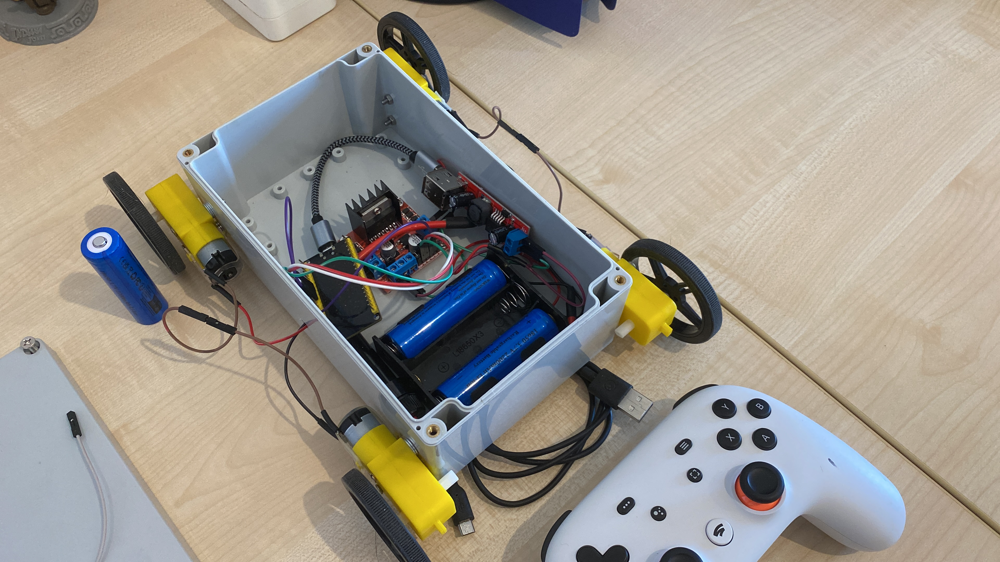

| Supported Targets | ESP32 | ESP32-C2 | ESP32-C3 | ESP32-C5 | ESP32-C6 | ESP32-C61 | ESP32-H2 | ESP32-S3 |
| ----------------- | ----- | -------- | -------- | -------- | -------- | --------- | -------- | -------- |

# ESP32 BLE HID Host — Stadia Controller Car

An ESP32 acting as a BLE HID host that connects to a Google Stadia controller and drives a miniature electric car via D-pad input.

Based on the ESP-IDF `esp_hid_host` example, extended with Stadia-specific BLE fixes, persistent pairing, automatic reconnection, and GPIO motor control.

---

## Car



---

## Hardware

- ESP32 development board
- Google Stadia controller (post-2022 BLE firmware)
- Dual H-bridge motor driver wired to:

| Signal | GPIO |
|--------|------|
| Motor 1 A | 12 |
| Motor 1 B | 14 |
| Motor 2 A | 27 |
| Motor 2 B | 26 |

---

## How to build and flash

```bash
idf.py set-target esp32
idf.py flash monitor
```

---

## First-time pairing

1. Flash and boot the ESP32 — it will start scanning.
2. Hold the Stadia button until the LED pulses rapidly (pairing mode).
3. The ESP32 finds the controller, pairs via BLE Secure Connections, and saves the address to NVS.
4. From this point on, every reboot reconnects automatically — no pairing mode needed.

To force re-pairing, erase NVS: `idf.py erase-flash` (note: this also clears BLE bond keys).

---

## Controls

D-pad maps directly to car movement:

| D-pad | Action |
|-------|--------|
| Up | Forward |
| Down | Backward |
| Left | Left |
| Right | Right |
| Neutral | Stop |

The car also stops immediately when the controller disconnects or powers off.

---

## Source files

| File | Role |
|---|---|
| `main/esp_hid_host_main.c` | Application logic: connection management, HID event handling, motor control |
| `main/esp_hid_gap.c` | GAP layer: BLE/BT scanning, advertisement parsing, security callbacks |
| `main/esp_hid_gap.h` | GAP public API |
| `main/Kconfig.projbuild` | Project-specific menuconfig options |
| `sdkconfig.defaults` | Minimum required Kconfig for the project |

---

## BLE scan filter fix

The original example only accepted devices advertising the HID service UUID (`0x1812`). The Stadia controller advertises with `UUID: 0x0000` and uses the BLE appearance value (`0x03C4` = Gamepad) instead.

The filter in `handle_ble_device_result` was extended to also accept devices in the HID appearance range (`0x03C0`–`0x03CF`):

```c
if (uuid == ESP_GATT_UUID_HID_SVC || (appearance >= 0x03C0 && appearance <= 0x03CF)) {
    add_ble_scan_result(...);
}
```

---

## Stadia controller HID report format

Determined empirically. Report ID 3, length 10 bytes:

| Byte | Bits | Content |
|------|------|---------|
| 0 | [3:0] | D-pad hat switch (0=Up, 2=Right, 4=Down, 6=Left, 8=Neutral) |
| 0 | [7:4] | Buttons |
| 1 | [7:0] | Buttons |
| 2 | [7:0] | bit6=A, bit5=B, bit4=X, bit3=Y, bit2=L1, bit1=R1 |
| 3 | [7:0] | Buttons (L3/R3/menu/etc — not fully mapped) |
| 4 | — | Left stick X (0x80 = center) |
| 5 | — | Left stick Y (0x80 = center) |
| 6 | — | Right stick X (0x80 = center) |
| 7 | — | Right stick Y (0x80 = center) |
| 8 | — | Left trigger (0 = released) |
| 9 | — | Right trigger (0 = released) |

---

## NVS peer address storage

On first successful connection the controller's BDA and address type are written to NVS under namespace `hidh`. On subsequent boots this is read back to skip scanning.

```
NVS namespace: "hidh"
  "peer_bda"   → 6-byte blob (BDA)
  "peer_atype" → uint8 (esp_ble_addr_type_t)
```

---

## Connection and reconnect architecture

A single **`reconnect_task`** runs for the lifetime of the application.

**First-time pairing** (no BDA in NVS):
- Loops with a full BLE+BT scan (5s) until a HID device is found, saves the BDA to NVS, then falls through to the reconnect loop.

**Reconnect loop** (BDA known):
- Calls `esp_ble_gattc_cache_clean()` then `esp_hidh_dev_open()` directly — no scan.
- The HCI layer retries the connection request internally for ~30s, catching the controller's advertising window on its own.
- Waits indefinitely for `HID_CONNECTED_BIT` or `HID_DISCONNECTED_BIT`.
- On `HID_CONNECTED_BIT` (GATT succeeded): waits for disconnect, then retries after 3s.
- On `HID_DISCONNECTED_BIT` without `HID_CONNECTED_BIT` (GATT or HCI failure): retries after 500ms.

**Event group bits** (set by `hidh_callback`):

| Bit | Set when |
|-----|----------|
| `HID_CONNECTED_BIT` | `ESP_HIDH_OPEN_EVENT` with `status == ESP_OK` (GATT succeeded) |
| `HID_DISCONNECTED_BIT` | `ESP_HIDH_CLOSE_EVENT` (any reason) or `ESP_HIDH_OPEN_EVENT` with `status != ESP_OK` |

**Why no scan on reconnect:** scanning is only needed when the BDA is unknown. Once it is known, `esp_hidh_dev_open()` can be called immediately; HCI handles the retry window internally. Scanning before connecting adds latency without providing any useful information.

**GATT failure behaviour:** Bluedroid's `gatt_rsp_timeout` fires ~40s after HCI connects if service discovery does not complete. This sets `HID_DISCONNECTED_BIT` via `CLOSE_EVENT` without ever setting `HID_CONNECTED_BIT`. The 500ms retry gives the controller's GATT server time to finish initialising before the next attempt.

---

## Key timing constants

| Constant | Value | Purpose |
|---|---|---|
| `SCAN_DURATION_SECONDS` | 5s | First-time pairing scan only |
| Retry delay — connected | 3s | Controller was in use then powered off |
| Retry delay — failed | 500ms | GATT or HCI failure; retry quickly |
